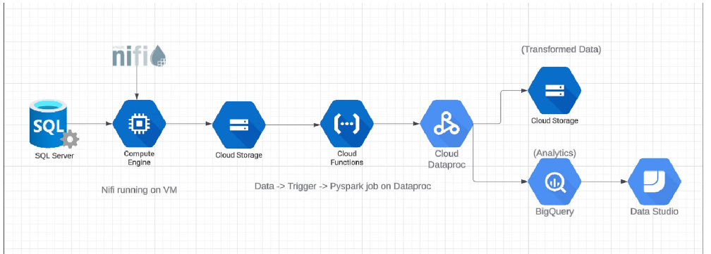

# FinancialData_Analytics

GCP-IaC:  Efficient ETL Pipeline for Financial Data Analytics.
## Aim
The aim of this project is to build an ETL pipeline for the Financial Data Set on GCP, enabling
the extraction, transformation, and loading of data from a SQL server to BigQuery for analytics
purposes.
Dataset Description
This project uses equity financial data from BseIndia, which includes stock price history from
various industry segments. A few of the fields included in the dataset are as follows
* Open_price
* High_price
* Low_price
* Close_price
* No_of_shares
* No_of_Trades
* Total_turnover
## Approach
* Use GCP Deployment Manager to create necessary resources like GCS buckets,
BigQuery tables, and a virtual machine.
* Install Apache NiFi on the virtual machine to extract data from the SQL server and dump
it into a GCS bucket.
* Create a cloud function to monitor the bucket for changes and trigger a PySpark job
using Cloud Dataproc.
* Utilize workflow templates to create a Dataproc cluster and execute the PySpark
transformation job.
* Load the transformed data into BigQuery for analytics and optionally store a backup in a
cloud storage bucket.

## Tech Stack
* Language: Python, SQL
* Services: SQL Server, AWS RDS, GCP Compute Engine, GCP Cloud Functions, Apache NiFi,
* GCP Cloud Storage, GCP BigQuery, GCP Dataproc, GCP Deployment Manager